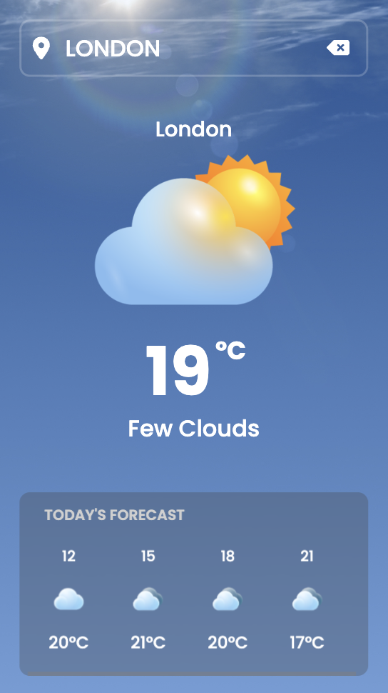
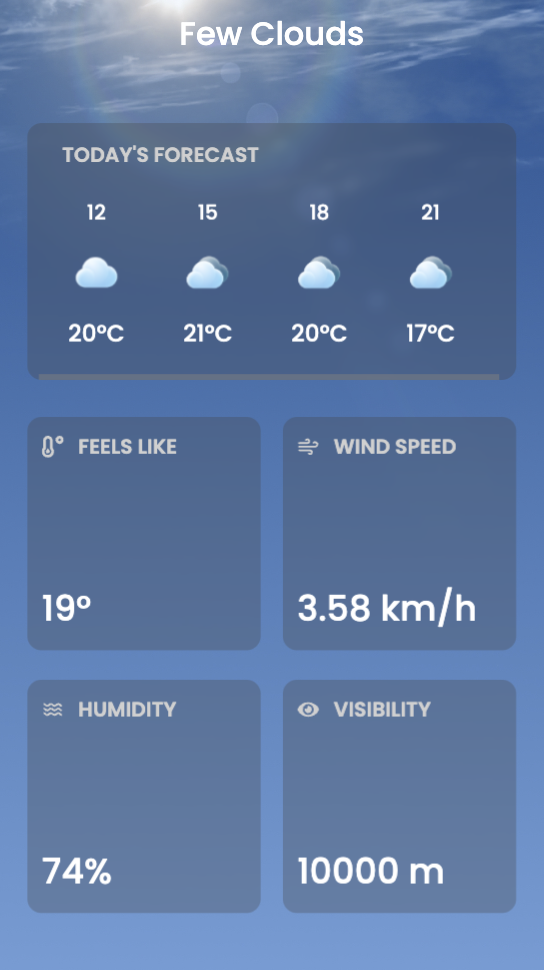
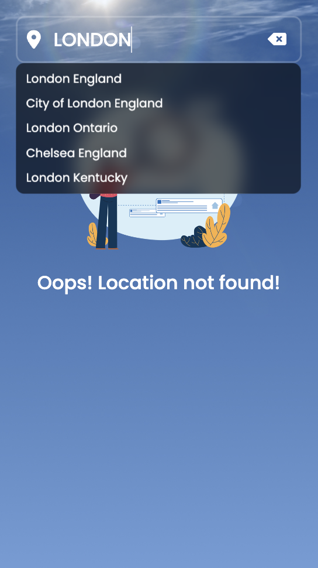
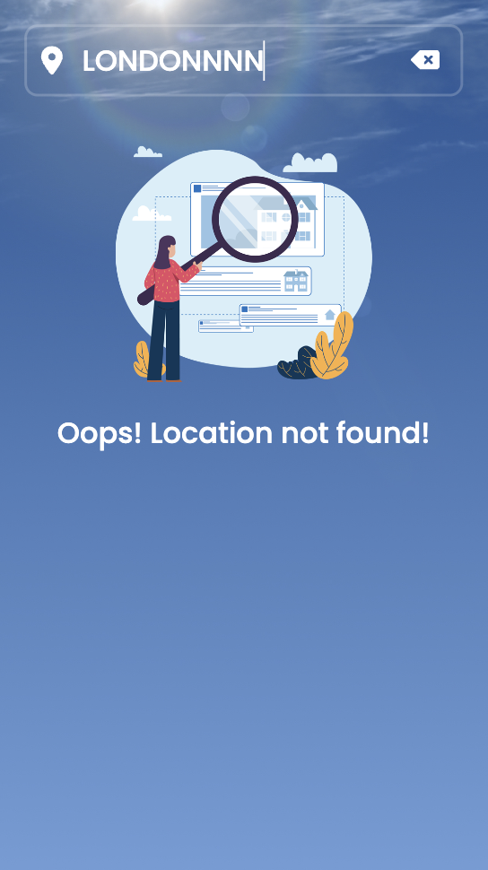

# Simple Weather App with React Js (Typescript)

Create a web-based weather application that allows users to input a location (city) and display the current weather information (temperature, humidity, wind speed, etc). This project was bootstrapped with [Create React App](https://github.com/facebook/create-react-app).

## App Demo

[SIMPLE WEATHER APP ](https://simple-weather-app-chi.vercel.app/)

## Warning

You need to get your own api key and replace it in WeatherApp.tsx file on line 80. Fir need to have your own account in [https://openweathermap.org/](https://openweathermap.org/) and use your own API key on the website.

## Features:

- [x] Location Input: Provide a text input field where users can enter the name of a city.
- [x] Weather Display: Once the user submits the location, fetch the weather data from a weather API (I used [OpenWeatherMap API](https://openweathermap.org/)).
- [x] Current Weather: Display the current temperature, weather conditions (e.g., suny, cloudy, rainy), feels like, wind speed, humidity, and visibility).
- [x] Background Images: Dynamically change the background image based on the current weather conditions (e.g., sunny for clear skies, rainy for rainy weather, etc).
- [x] Forecast: Show a forecast for today (3 hour forecast, that's because of the limitations given to free plan users).
- [x] Responsive Design: Ensure the application is responsive and works well on various devices(desktops, tablets, smartphones).
- [x] Error Handling: Hnadle errors gracefully, such as invalid location input (it will show meaningful error message).
- [x] UI/UX Design: Design an intuitive and user-friendly interface with appropriate icons and styling for weather conditions.

## Optional Enhancements

- Background video: Allow telling the weather visually attractive tot the users.
- Geolocation: Allow users to get weather information based on their current location using the browser's geolocation API.
- Unit Conversion: Provide an option to switch between Celcius and Fahrenheit for temperature display.
- Additional Weather Data: Display additional weather data such as sunrise/sunset times, UV index, or air quality index (if available from the API).

## Screenshoot

Here we have project screenshot :

## About the code

- Need to be constantly refactored.
- Need to create a testing.

### `npm start`

Runs the app in the development mode.
Open [http://localhost:3000](http://localhost:3000) to view it in the browser.

The page will reload if you make edits.
You will also see any lint errors in the console.

### `npm run build`

Builds the app for production to the `build` folder.
It correctly bundles React in production mode and optimizes the build for the best performance.

The build is minified and the filenames include the hashes.
Your app is ready to be deployed!

See the section about [deployment](https://facebook.github.io/create-react-app/docs/deployment) for more information.

### `npm run eject`

**Note: this is a one-way operation. Once you `eject`, you can’t go back!**

If you aren’t satisfied with the build tool and configuration choices, you can `eject` at any time. This command will remove the single build dependency from your project.

Instead, it will copy all the configuration files and the transitive dependencies (webpack, Babel, ESLint, etc) right into your project so you have full control over them. All of the commands except `eject` will still work, but they will point to the copied scripts so you can tweak them. At this point you’re on your own.

You don’t have to ever use `eject`. The curated feature set is suitable for small and middle deployments, and you shouldn’t feel obligated to use this feature. However we understand that this tool wouldn’t be useful if you couldn’t customize it when you are ready for it.

## Learn More

You can learn more in the [Create React App documentation](https://facebook.github.io/create-react-app/docs/getting-started).

To learn React, check out the [React documentation](https://reactjs.org/).
